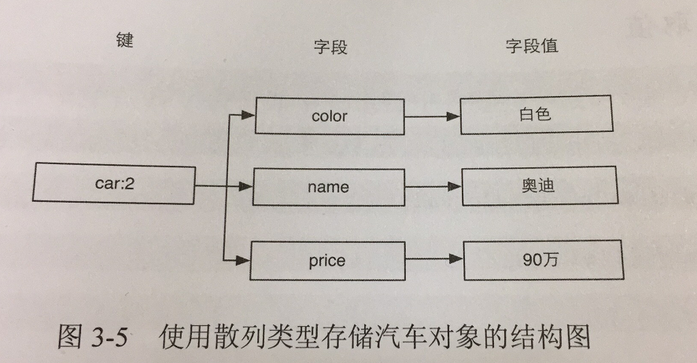

# redis入门指南

[TOC]

### 基本的数据类型

###### string

```
SET key keyvalue
MSET key keyvalue [key keyvalue]

GET key
MGET key [key...]

DEL key		//删除key

INCR key
INCRBY key increment
INCRBYFLOAT key increment

DECR key
DECRBY key increment
// 位操作
GETBIT key offset
SETBIT key offset value
BITCOUNT key [start] [stop]	// 开始第几个字节，到最后第几个字节
BITOP operation destkey key [key...]	// BITOP OR result test1 test2

EXISTS key		//判断一个键是否存在

KEYS pattern	// 符合规则的键名列表(通用)
```

###### 散列类型H



采用键 —— 字段 —— 字段值：其中字段只能是字符串，不支持其他数据类型

```
HSET key fied value
HMSET key field value [field value...]

HGET key field
HMGET key field [field...]
HGETALL key
HKEYS key	// key所有字段
HVALS key	// key所有字段值

HDEL key field [field]

HINCRBY key field increment

HEXISTS key field	// 判断是否存在

HLEN key	// key的字段数
```

###### 列表类型/L

采用双向链表制作而成

```
LPUSH key value [value...]		//左添加
RPUSH key value [value...]		//右添加
LSET key index value
LINSERT key BEFORE|AFTER pivot value // 把value插在pivot 前或者后

LINDEX key index
LRANGE key start stop	// 获取列表中某一片段[start stop]

LPOP key	//左弹出
RPOP key 	//右弹出
RPOPLPUSH	source destination	//从source rpop一个，lpush到destination

LREM key count value	// 删除列表中前count个值为value的元素
LTRIM key start stop	// 删除[start stop]之外的元素

LLEN key 	// list中包含数据数量
```

###### 集合类型/S

采用值为空的散列表实现的（无序）

```
SADD key member [member ...]	// 添加一个成员

SRANDMEMBER key [count] 	//随机获取一个元素，count为个数
SMEMBERS key	//获取集合所有元素

SPOP key 	// 随机弹出一个，并删除
SREM key member [member ...]	// 删除一个成员

SISMEMBER key member	// 判断member在不在集合中

SCARD key	// 获取集合中元素个数

SDIFF key [key...]		// 差集第一个减去第二的...
SINTER key [key...]		// 交集
SUNION key [key...]		//合集

SDIFFSTORE destination key [key...]	// 结果存储在destination
SINTERSTORE destination key [key...]	// 结果存储在destination
SUNIONSTORE destination key [key...]	// 结果存储在destination
```

###### 有序集合类型/Z

```
ZADD key score member [socre member...] 	// 增加元素

ZSCORE key member	//查看元素分数
ZRANGE key start stop [WITHSCORES]		// 获取排名在某个范围内的元素，以索引范围，从0开始
ZREVRANGE key start stop [WITHSCORES] //从大到小
ZRANGEBYSCORE key min max [WITHSCORES] [LIMIT offset count]
ZRANK key member	//获取元素排名
ZREVRANK key member		// 由大到小获取元素排名

ZREM key member [member...]  	// 删除元素
ZREMRANGEBYRANK key start stop 		//按照排名范围删除元素，start,stop即索引
ZREMRANGEBYSCORE key min max		// 按照分数范围删除

ZINCRBY key increment member	//增加某个元素的分数

ZCARD key 		//获取元素中的个数
ZCOUNT key min max // 指定范围元素个数

ZINTERSTORE destination numkeys key [key...] [WEIGHTS weight [weight ...]] [AGGREGATE SUM|MIN|MAX]
ZUNIONSTORE ...		// 同上
```

### 进阶

###### 事务

```
MULTI	// 开启事务
.....
EXEC	// 依次执行返回 这些命令返回值组成的列表
```

###### 独占

```
WATCH key [key...]	// 只要有一个键被修改或者删除，后面的事务就不会执行，exec后便取消
UNWATCH 	// 取消所有监控
```

###### 过期时间

```
EXPIRE key seconds	// 设置过期时间
PEXPIRE key millionseconds	// 设置过期时间
TTL key		// 返回剩余时间
PTTL key		// 返回剩余时间毫秒
```

###### SORT命令

```
SORT key [BY pattern] [LIMIT offset count] [GET pattern [GET pattern ...]] [ASC|DESC] [ALPHA] [STORE destination]

SORT mylist DESC
SORT mylist ASC ALPHA
SORT mylist DESC LIMIT 1 2
SORT myhash BY hash:*->time DESC
SORT myhash BY hash:*->time GET hash:*->title
...
```

###### 任务队列

```
BRPOP key [key ...] timeout	// 一直堵塞，直到在timeout时间内获取其中一个新元素，否则返回 nil ， timeout 为 0 ，表示一直堵塞，直到...
BLPOP 略
```

###### 发布/订阅

```
PUBLISH	channel message		// 一次发布一个
SUBSCRIBE channel [channel ...]	// 订阅
PSUBSCRIBE pattern [pattern ...]	// 按规则匹配订阅
```

### 持久化

##### RDB方式

- 自动快照： save 900 1


- SAVE	// 立刻同步快照


- BGSAVE	// 异步快照


- FLUSHALL	// 清空所有数据

##### AOF方式

- 开启AOF方式：appendonly yes		appendfilename appendonly.aof
- auto-aof-rewrite-percentage 100    超过上次100%时精简重写
- auto-aof-rewrite-min-size 64mb    超过64mb就不允许重写了

##### 同步硬盘数据

- #appendfsync   always	// 每次执行写入都会执行同步，慢
- **appendfsync  everysec       //  每秒执行一次同步**
- #appendfsyn no                  // 没30秒同步一次，喔呵


[家啊可是]: http://www.baidu.com	"nice"

